# Guide to running Corrade in Google Cloud Platform

### Table of contents
1. Signing up for Google Cloud Platform
1. Setting up a micro instance to run a Corrade container
1. Configuring Corrade for use with Allomancy

## Signing up for Google Cloud Platform
Simply navigate to [cloud.google.com](https://cloud.google.com/) and click the "Get started for free" button.
Return to this guide when you have set up GCP and are ready to set up your first container instance.

## Setting up a micro instance to run a Corrade container
In this section we are going to use a micro Compute Engine instance to run Corrade in a so called container. A container is an encapsulation of everything a given software needs, and almost nothing else. This makes it both easier to manage and more secure.

### Create Instance
* Navigate to [Compute Engine/VM instances](https://console.cloud.google.com/compute/instances) and click `Create Instance`.

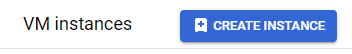

### Machine Configuration panel
* Set name, for example `corrade-allomancy`
* Set *region* to `us-west1` (this is the closest zone to the Second Life servers which is also eligible for the Free Tier)
* Leave *machine series* at `E2`
* The *Machine type* should be `e2-micro` (under the *Shared-core* group)
* Do NOT click ~~*Create*~~ but click *OS and Storage* in the menu on the left

### OS and storage panel
* Click *Deploy Container* at the bottom

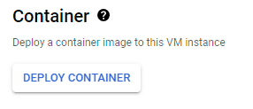
* Paste `wizardrysteamworks/corrade:latest` in *Container image*
* Add a *Volume mount*
    * *Volume type* `Directory`
    * *Mount path* `/etc/corrade`
    *  *Host path* `/home/corrade/config`
    *  *Mode* `Read/write`
    * Click *Done*
* Click *Select*
*
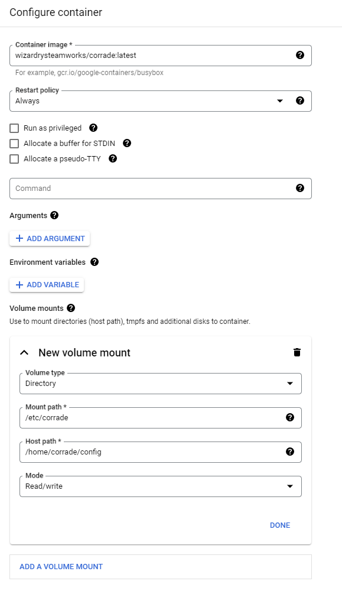
* Do NOT click ~~*Create*~~ but click *OS and Storage* in the menu on the left

### Networking panel
* Check *Allow HTTP traffic* (not *HTTPS*)
* You can now click *CREATE* and wait until your container instance is running

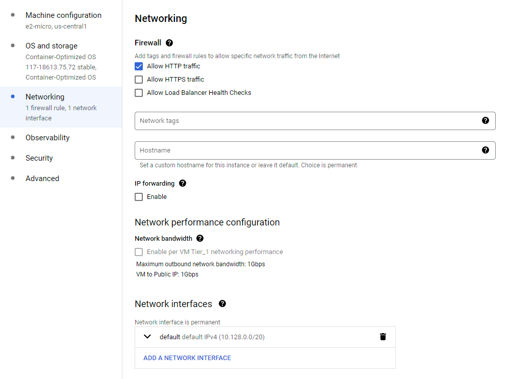

### Setting Corrade Nucleus password
* When your instance has started go to [VM Instances](https://console.cloud.google.com/compute/instances) and click where is says *SSH* at the end of the line of your new instance.

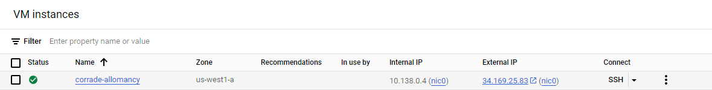

* Click *Authorize* when it asks
* Type the following commands
  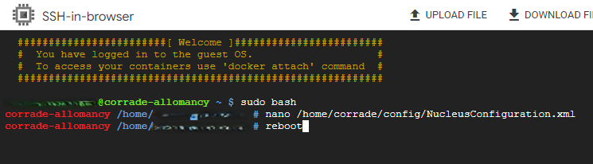

    * `sudo bash`
    * `nano /home/corrade/config/NucleusConfiguration.xml` (if the file doesn't exist, just wait a couple of minutes until the installation process is complete)

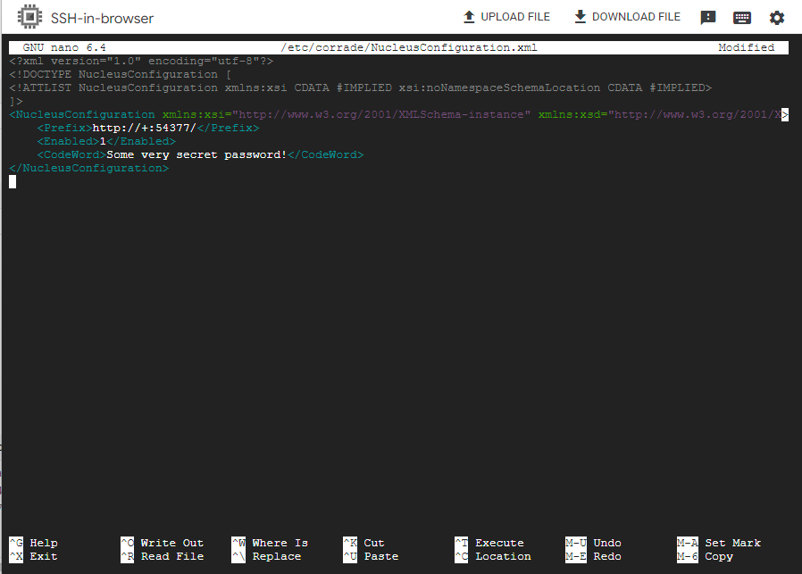

* Edit the file between the `<CodeWord>` and the `</CodeWord>` tags. Leave the tags! Set a strong password.
* Hit `ctrl-x`
* It asks if you want to save, answer `Yes`
* It asks for filename, just hit `Enter`
* Now reboot the instance for the changes to take effect by typing `reboot`

### Setting a static IP address
For Allomancy to be able to reach our bot, it needs to always have the same IP address, so we will make it static.
* Go back to [VM Instances](https://console.cloud.google.com/compute/instances) and click *nic0* after the public IP address:

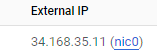

* Click the menu in the top left corner and chose *IP addresses*

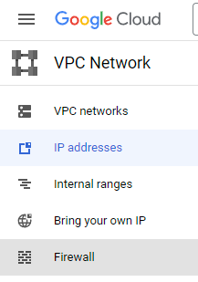

* On the line with the public IP address, click the three dots under *Actions* and select *Promote to Static IP address*

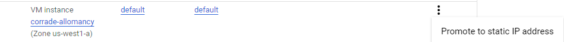

* Give the IP address a name. This is just for internal use and not a DNS domain name.

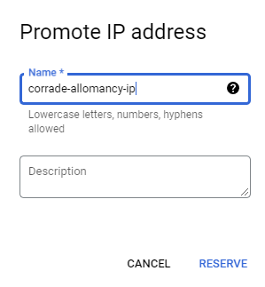

* Click *RESERVE*

### Allowing access to Nucleus from only your own IP address
We will now give our home IP address access to the Corrade configuration management.
**Every time your IP address changes, you will have to update this address**
* In the menu in the top left, select *Firewall*, or click this link [Firewall](https://console.cloud.google.com/net-security/firewall-manager/firewall-policies/list)

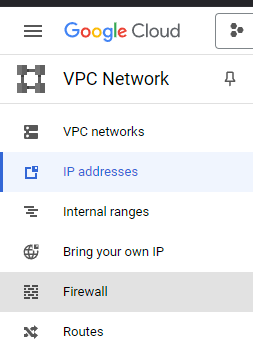

* At the top, click *Create Firewall Rule* (NOT "Create Firewall Policy")

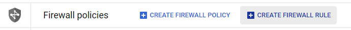

* Fill in *Name* `nucleus-from-home`
* Scroll down to *Targets* and select `All instances in the network`
* Open (in a new tab) [What's my IP](https://www.whatismyip.com/)
* Click the Copy icon behind *My Public IPv4*

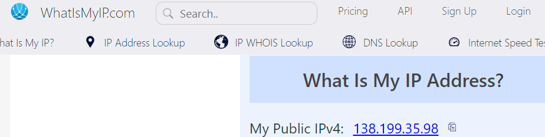

* Paste this address in *Source IPv4 ranges* and hit enter

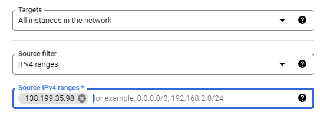

* Scroll down to and select *Specified protocols and ports*
* Enable the *TCP* box, and paste `54377`
* Click *CREATE*

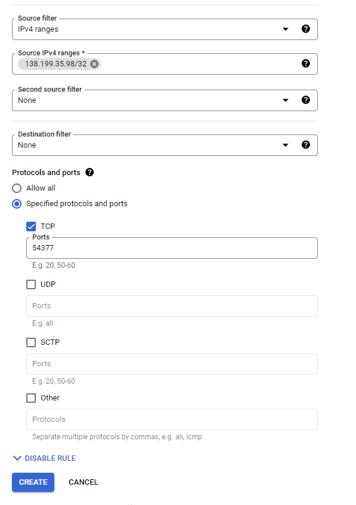

### Configure Corrade
You should now be able to navigate to your bot's configuration page.
**ONLY ACCESS THIS FROM A NETWORK YOU TRUST** (anyone can sniff your password, it's not encrypted)
If you find yourself in need of encrypted access, you can look into setting up an SSH tunnel. You'll need to add a SSH cert to your instance and have an ssh client installed on your computer. That's out of scope for this guide though.
* Yet again go back to [VM Instances](https://console.cloud.google.com/compute/instances) and copy the external IP address

* Paste the address in your browser like so: `http://PASTE_IP_ADDRESS:54377/`

* 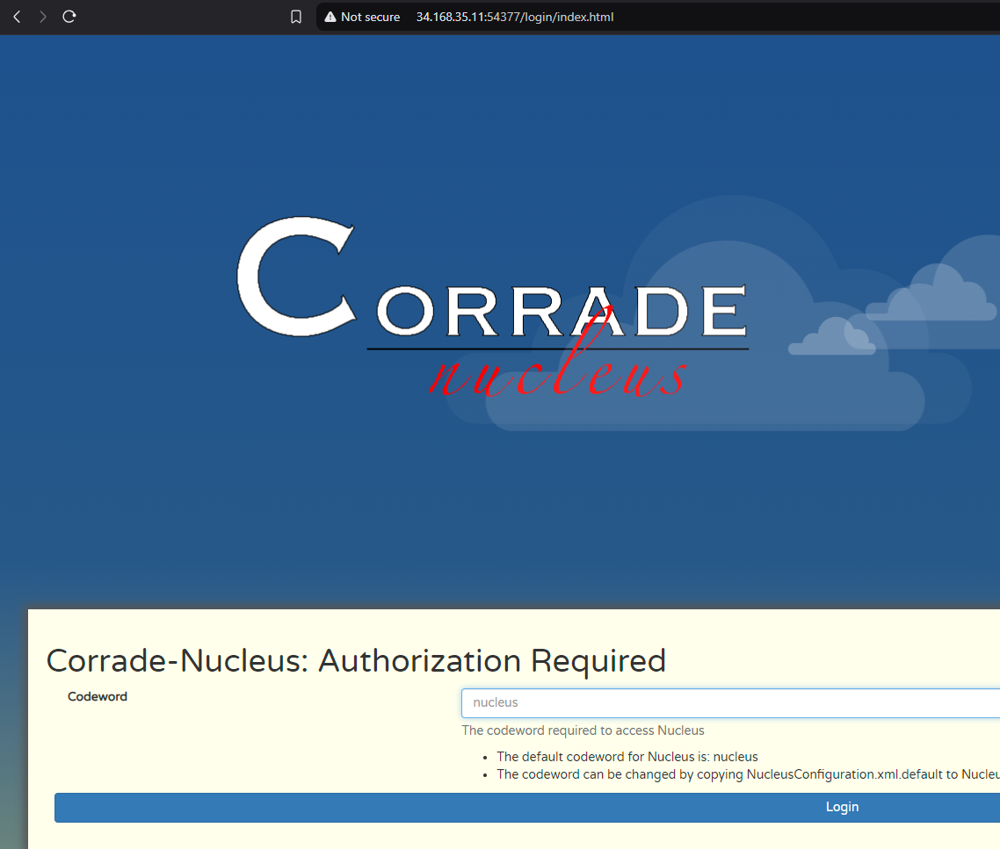
